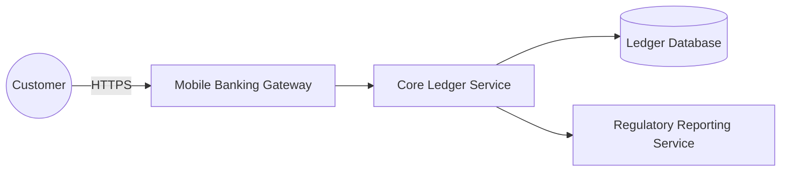

# Core Banking Platform

A financial-services core banking platform. Customers authenticate
through a mobile banking gateway, which forwards transactions to a core
ledger service. The core ledger service writes to a ledger database and
reports to a regulatory reporting service.

