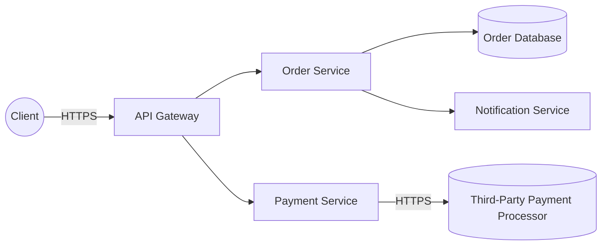

# Microservices with Third-Party Integrations

A microservices e-commerce backend. Client requests arrive at an API
Gateway, which routes to an Order Service and a Payment Service. The
Payment Service integrates with a third-party Payment Processor over the
public internet. The Order Service writes to its own database and
publishes events consumed by a Notification Service.

