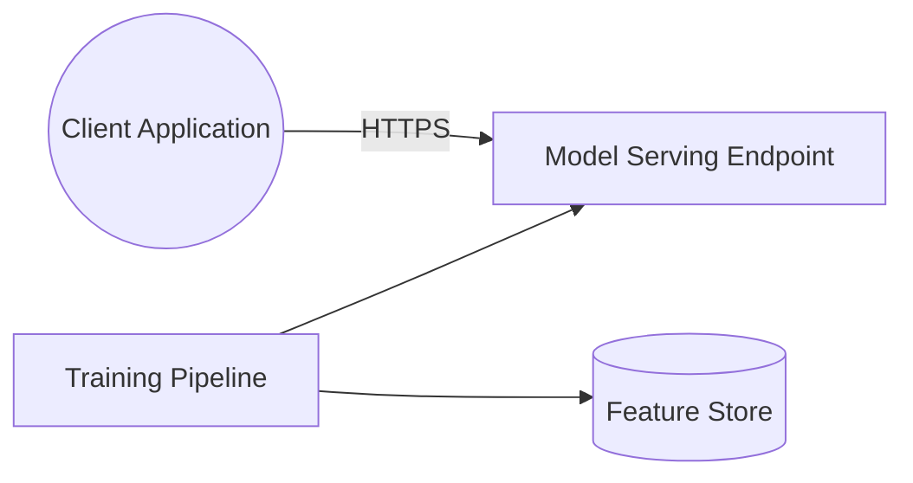

# ML Inference Platform

A machine-learning inference platform. A client application sends
requests to a model serving endpoint, which loads models produced by a
training pipeline that reads from a feature store.

