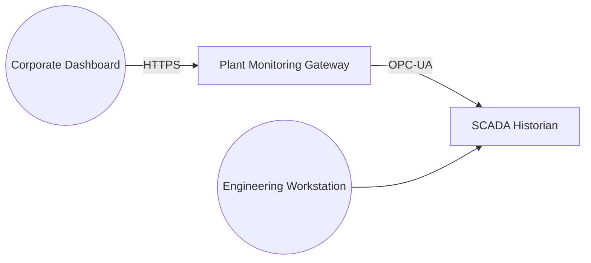

# Plant Monitoring Gateway with OT Elements

A plant-monitoring gateway that bridges an IT network to operational
technology equipment. An engineering workstation reads data from a SCADA
Historian on the OT side, and a corporate dashboard reads a summary from
the gateway over the IT network.

