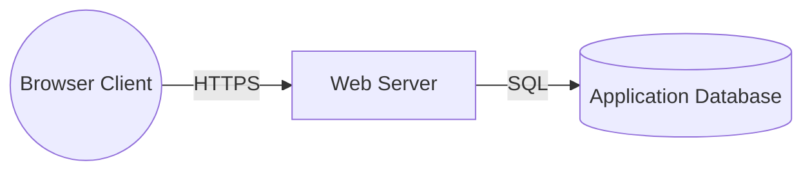

# Simple Web App

A small internet-facing web application. A browser client talks to a web
server over HTTPS, and the web server reads and writes to a single
relational database.

```mermaid
flowchart LR
    Client((Browser Client)) -->|HTTPS| WebServer[Web Server]
    WebServer -->|SQL| Database[(Application Database)]
```
